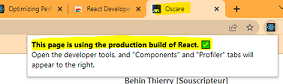

# Comment combiner et minifier des scripts avec react (BP079)

## Règle

:recycle: Combiner les fichiers js/css afin de réduire le nombre de requêtes HTTP.
Minifier les fichiers js/css afin d'obtenir des fichiers avec un poids réduit.  

## Gains

Gain sur la performance et les échanges réseaux.

## Valider la mise en place de la bonne pratique

Avec l'utilisation du package react-scripts [create react app](https://github.com/facebook/create-react-app), assurez-vous, lors de la création de votre package, d'utiliser ``react-scripts build`` et de désactiver le ``source map``.

:x: Code à éviter

```cs
react-scripts start
```

:heavy_check_mark: Code à favoriser

```cs
GENERATE_SOURCEMAP=false react-scripts build
```

Points de contrôle

- [ ] Assurez-vous que vos applications en react utilisent la bonne configuration dans les environnements de recette et production.
- [ ] Via les outils de développement de chrome / edge, assurez-vous que les scripts se terminent par chunk.css ou chunk.js
- [ ] Les scripts chunk.css/chunk.js sont correctement minifiés
- [ ] Dans la response header des scripts chunk.css/chunk.js, on retrouve bien la balise : Strict-Transport-Security: max-age=31536000;
- [ ] Avec [React Developer Tools](https://chrome.google.com/webstore/detail/react-developer-tools/fmkadmapgofadopljbjfkapdkoienihi), assurez-vous de l'utilisation d'un package optimisé  


## Liens

- [Créer une app react en production](https://create-react-app.dev/docs/production-build)
- [Déployer une app react en production](https://create-react-app.dev/docs/deployment)
- [Optimiser un package react](https://reactjs.org/docs/optimizing-performance.html)
- [React Developer Tools](https://chrome.google.com/webstore/detail/react-developer-tools/fmkadmapgofadopljbjfkapdkoienihi)
